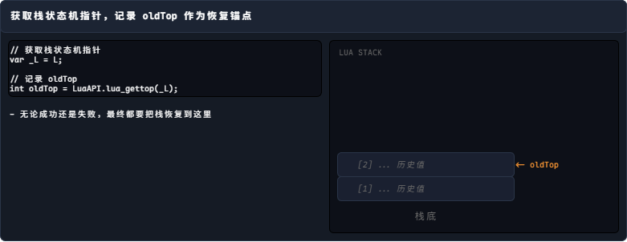
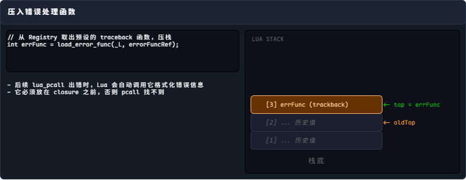
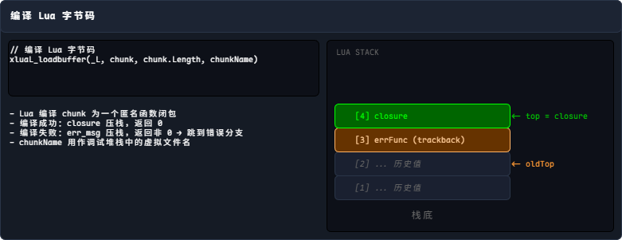
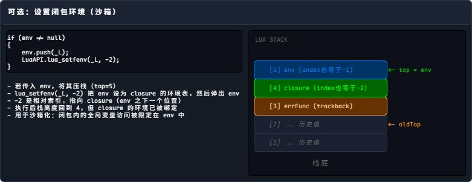
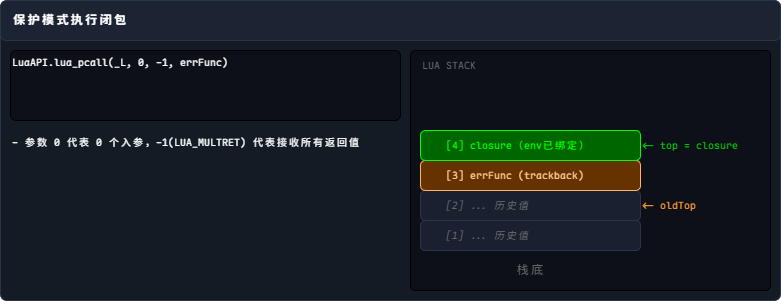
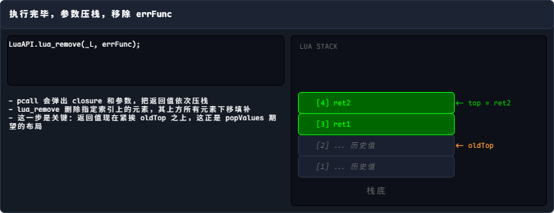
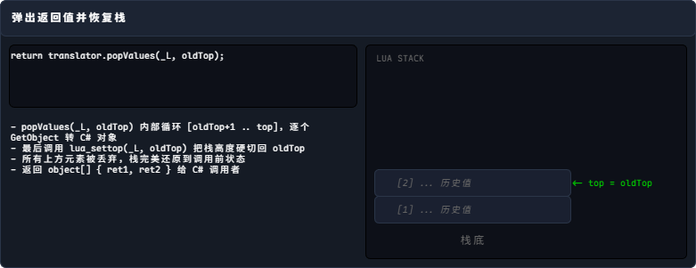

C# 调用 Lua 有多种方式，但归根结底可以分为两种：

- LuaEnv.DoString 直接执行一段 Lua 代码
- 通过 LuaTable.Get 获得一个整数句柄，通过这个句柄可以进一步访问 Lua 的对象或者方法

`DoString` 有两个版本，传入字符串的版本是对字节数据版本的便利性封装

```cs title="DoString的函数定义"
// 字符串版本
public object[] DoString(
    string chunk, string chunkName = "chunk", LuaTable env = null)
{
    byte[] bytes = System.Text.Encoding.UTF8.GetBytes(chunk);
    return DoString(bytes, chunkName, env);
}

// 字节数组版本
public object[] DoString(
    byte[] chunk, string chunkName = "chunk", LuaTable env = null)
{
#if THREAD_SAFE || HOTFIX_ENABLE
    lock (luaEnvLock)
    {
#endif
        var _L = L;
        int oldTop = LuaAPI.lua_gettop(_L);
        int errFunc = LuaAPI.load_error_func(_L, errorFuncRef);
        if (LuaAPI.xluaL_loadbuffer(_L, chunk, chunk.Length, chunkName) == 0)
        {
            if (env != null)
            {
                env.push(_L);
                LuaAPI.lua_setfenv(_L, -2);
            }

            if (LuaAPI.lua_pcall(_L, 0, -1, errFunc) == 0)
            {
                LuaAPI.lua_remove(_L, errFunc);
                return translator.popValues(_L, oldTop);
            }
            else
                ThrowExceptionFromError(oldTop);
        }
        else
            ThrowExceptionFromError(oldTop);

        return null;
#if THREAD_SAFE || HOTFIX_ENABLE
    }
#endif
}
```

步骤剖析：

=== "Step 1"

    

=== "Step 2"

    

=== "Step 3"

    

=== "Step 4"

    

=== "Step 5"

    

=== "Step 6"

    

=== "Step 7"

    

关于 `translator.popValues` 这个函数，目前只用知道它大概做了哪些事即可。后续会逐渐了解 `ObjectTranslator` 的设计。