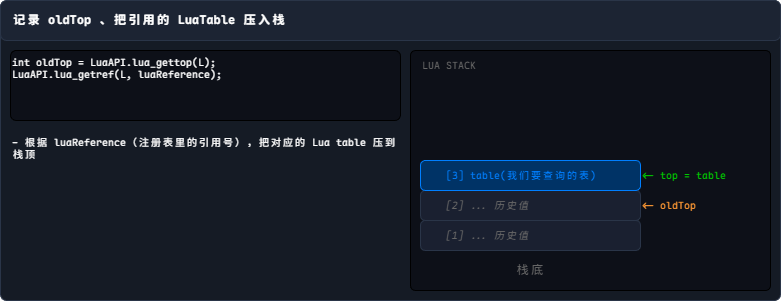
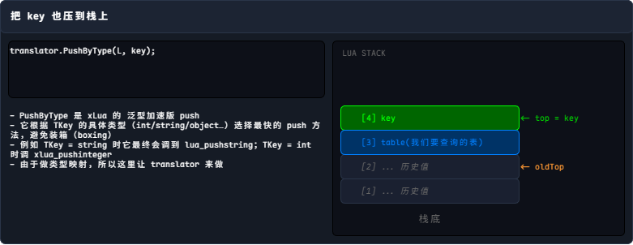
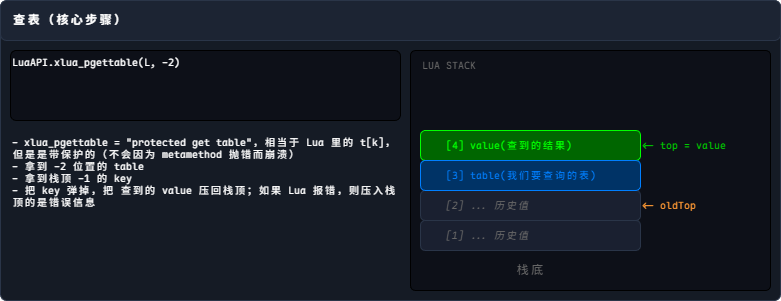
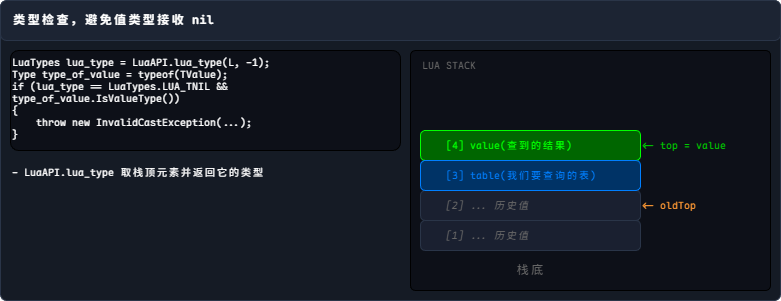
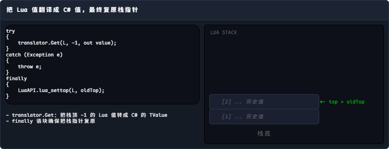

通过这个调用，我们可以在 C# 一侧得到 Lua 对象或者方法的整数句柄，先了解清楚这个机制，后续才能明白 C# 调用 Lua 是怎么运作的。

`LuaTable.Get` 有一些多态版本，但最核心的是下面这个版本的实现，其他还有装箱版本，但现在也废弃了，不提倡使用。

```cs title=""
public void Get<TKey, TValue>(TKey key, out TValue value)
{
#if THREAD_SAFE || HOTFIX_ENABLE
    lock (luaEnv.luaEnvLock)
    {
#endif
        var L = luaEnv.L;
        var translator = luaEnv.translator;
        int oldTop = LuaAPI.lua_gettop(L);
        LuaAPI.lua_getref(L, luaReference);
        translator.PushByType(L, key);

        if (0 != LuaAPI.xlua_pgettable(L, -2))
        {
            string err = LuaAPI.lua_tostring(L, -1);
            LuaAPI.lua_settop(L, oldTop);
            throw new Exception("get field [" + key + "] error:" + err);
        }

        LuaTypes lua_type = LuaAPI.lua_type(L, -1);
        Type type_of_value = typeof(TValue);
        if (lua_type == LuaTypes.LUA_TNIL && type_of_value.IsValueType())
        {
            throw new InvalidCastException("can not assign nil to " + type_of_value.GetFriendlyName());
        }

        try
        {
            translator.Get(L, -1, out value);
        }
        catch (Exception e)
        {
            throw e;
        }
        finally
        {
            LuaAPI.lua_settop(L, oldTop);
        }
#if THREAD_SAFE || HOTFIX_ENABLE
    }
#endif
}
```

在开始之前，先讲一下 `luaReference` 是什么。它是 C# 侧的 LuaTable 对象对 Lua 侧某个对象的引用，本质上是一个整数句柄。由于两侧 GC 不同，直接持有 Lua 对象是不合理的，所以 xLua 把这个 table 存到 Lua 注册表（LUA_REGISTRYINDEX）里，返回这个索引作为句柄。之后在 C# 这边只持有这个句柄，要访问这个 Lua 对象时通过调用 `lua_getref` 把 Lua 对象压入栈。

步骤剖析：

=== "Step 1"

    

=== "Step 2"

    

=== "Step 3"

    

=== "Step 4"

    

=== "Step 5"

    

Lua 的所有对象本质上都是一个 Table，而执行一个特定的 Lua 逻辑，本质上就是 `LuaTable.LuaFunction()`，有了 `LuaTable.Get` 既可以获取一个 LuaTable，又可以从 LuaTable 中获取指定的 LuaFunction ，所以 C# 调用 Lua 是可行的。现在比较常用的方式有两种：

- **Get<LuaFunction\>**：将获得的 Lua 函数作为 LuaFunction 使用
- **Get<强类型委托>**：比较推荐的做法，自定义委托类型

后面几篇逐个讲解。