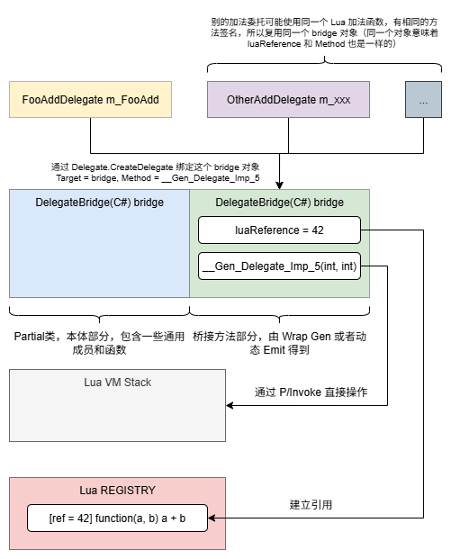

强类型委托是比较推荐的一种方案，相较于泛型版本的 LuaFunction，它的灵活性更高。下面是一个使用示例：

```lua title="假设 lua 一侧有这样的函数定义"
local Foo = {}

-- 实现一个简单的加法计算
function Foo.Add(a, b)
    return a + b
end

return Foo
```

```cs title="C# 一侧通过强类型委托的方式实现跨域调用"
// 1. 声明并打标记
[CSharpCallLua]
public delegate int FooAddDelegate(int a, int b);

// 2. 拿委托
var addDelegate = fooTable.Get<FooAddDelegate>("Add");

// 3. 调用
int sum = addDelegate(1, 2);
```

下面逐步拆解：

## 1. 前面的调用路径和 Get<LuaFunction> 一样

前面的流程一致，都是调用 Get<T>，简要带过一下：

- `lua_gettop / lua_getref / PushByType("Add") / xlua_pgettable` 执行完，栈顶得到目标 **lua function**
- `translator.Get<FooAddDelegate>` 快表里没有 `FooAddDelegate`，走慢路径
- `GetObject(L, -1, typeof(CalcDelegate)` lua function 不是 userdata，所以进入 `GetCaster` 路径

## 2. 分歧出现，非预定义的 caster 有各种处理逻辑

```cs title=""
public ObjectCast GetCaster(Type type)
{
    if (type.IsByRef) type = type.GetElementType();

    Type underlyingType = Nullable.GetUnderlyingType(type);
    if (underlyingType != null)
    {
        return genNullableCaster(GetCaster(underlyingType));
    }
    ObjectCast oc;
    if (!castersMap.TryGetValue(type, out oc))
    {
        oc = genCaster(type);
        castersMap.Add(type, oc);
    }
    return oc;
}
```

`LuaFunction` 在 `casterMap` 中预定义了，而 `FooAddDelegate` 是自定义委托，所以不会有预定义，这里走 `genCaster` 分支。

## 3. 动态生成类型转换

```cs title=""
private ObjectCast genCaster(Type type)
{
    // 通用前置：先尝试当 userdata 取（兼容 C# 委托被反包装的场景）
    ObjectCast fixTypeGetter = (L, idx, target) =>
    {
        if (LuaAPI.lua_type(L, idx) == LuaTypes.LUA_TUSERDATA)
        {
            object obj = translator.SafeGetCSObj(L, idx);
            return (obj != null && type.IsAssignableFrom(obj.GetType())) ? obj : null;
        }
        return null;
    };

    if (typeof(Delegate).IsAssignableFrom(type))   // FooAddDelegate 满足这个条件
    {
        return (L, idx, target) =>
        {
            object obj = fixTypeGetter(L, idx, target);
            if (obj != null) return obj;          // 尝试当 userdata 取

            if (!LuaAPI.lua_isfunction(L, idx))
                return null;

            return translator.CreateDelegateBridge(L, type, idx);  // 核心入口
        };
    }
    else if (type.IsInterface()) { ... }
    else if (type.IsEnum())      { ... }
    else if (type.IsArray)       { ... }
    ...
}
```

由于 `FooAddDelegate` 是委托，走委托的这个分支。注意这里返回一个 lambda 式子，返回后会缓存到 `casterMap` 中，所以动态生成只发生一次。

## 4. CreateDelegateBridge：核心逻辑

这里逻辑稍微复杂了一些，要搞清楚发生了什么，需要先建立一些心智模型：

### 4.1 委托的本质

C# 委托 Delegate 主要包含两个成员：

- Method：委托保存的方法指针
- Target：这个方法所属的对象

所以，委托可以简单理解为保存了 `Target.Method`，发生调用时等价于 `Target.Method()`，这里不讲过深。

### 4.2 关系图


/// caption
关系图
///

一个 lua function 需要在 C# 侧有一个 bridge 对象与之绑定，这个 bridge 对象还需要定义一个操作栈的函数，确保匹配这个 lua function 的函数签名，以便正确地操作虚拟机栈，传递正确的参数和返回值。所以对于 C# 侧来说，一个 bridge 对象可以看做是对一个 lua function 的代理，它们是一一对应的。

`DelegateBridge` 类本身不定义类似 `__Gen_Delegate_Imp_5` 这些桥接方法，因为 xLua 无法主动知道哪些 lua function 会被 C# 侧以委托的方式调用。xLua 提供了两种方式来解决这个问题，第一种是用户主动给自定义委托打 `[CSharpCallLua]` 标签，这样可以在 Wrap 生成时自动生成对应的桥接方法；第二种方式是通过动态 Emit 在代码执行时直接生成对应的 IL 内容到内存中，这种方式不会落地 cs 文件，并且只能在使用 .NET Framework 的编辑器环境下生效，也许是为了便于开发期使用。

对于 C# 上层实际的单个委托来说，xLua 的工作就是先找到目标 lua 函数对应的 bridge 对象，然后绑定给这个委托对象，确保能被正确调用；另外，还需要建立缓存，以便在下次别的地方获取同一个 lua 函数时可以直接命中。

### 4.3 讲解函数执行步骤

=== "Step 1"

    ```cs title="先查这个 lua 函数是否已经有 bridge"
    // 将栈顶原有的 function 复制一份到栈顶
    LuaAPI.lua_pushvalue(L, idx);

    // REGISTRY[function]，后续步骤可以看到：
    // 首次建立 bridge 时做了双向映射，为的就是这里可以反查
    LuaAPI.lua_rawget(L, LuaIndexes.LUA_REGISTRYINDEX);

    if (!LuaAPI.lua_isnil(L, -1)) // 已经存在对应的 bridge
    {
        int referenced = LuaAPI.xlua_tointeger(L, -1);
        LuaAPI.lua_pop(L, 1); // 取出 ref 后，栈顶的 ref 没用了弹出

        // 这里 delegate_bridges 使用的弱引用，为了被正确 GC
        // bridge 还在被引用就复用，没有就走到首次建立的分支
        if (delegate_bridges[referenced].IsAlive)
        {
            if (delegateType == null)
            {
                return delegate_bridges[referenced].Target;
            }
            DelegateBridgeBase exist_bridge
                = delegate_bridges[referenced].Target as DelegateBridgeBase;
            Delegate exist_delegate;
            if (exist_bridge.TryGetDelegate(delegateType, out exist_delegate))
            {
                // bridge 还包含这个类型的委托，直接复用
                return exist_delegate;
            }
            else
            {
                // bridge 还有效，但这个类型的委托曾被回收过，再建立一次
                exist_delegate = getDelegate(exist_bridge, delegateType);
                // 加入 bridge 的内部缓存
                exist_bridge.AddDelegate(delegateType, exist_delegate);
                return exist_delegate;
            }
        }
    }
    else
    {
        LuaAPI.lua_pop(L, 1); // 不存在对应的 bridge，
        // 在首次建立 bridge 之前先把栈顶的 ref 弹出
    }
    ```

=== "Step 2"

    ```cs title="首次建立 bridge 先做双向映射"
    // 复制 function 到栈顶
    LuaAPI.lua_pushvalue(L, idx);
    // REGISTRY[ref] = function (弹掉了栈顶 function)
    int reference = LuaAPI.luaL_ref(L);
    // 再复制一份 function
    LuaAPI.lua_pushvalue(L, idx);
    // 把 ref 数字也压栈
    LuaAPI.lua_pushnumber(L, reference);
    // REGISTRY[function] = ref（弹掉这两个）
    LuaAPI.lua_rawset(L, LuaIndexes.LUA_REGISTRYINDEX);
    ```

=== "Step 3"

    ```cs title="创建 DelegateBridge 对象"
    #if (UNITY_EDITOR || XLUA_GENERAL) && !NET_STANDARD_2_0
        if (!DelegateBridge.Gen_Flag)
        {
            // 编辑器 + .NET Framework 环境下，如果没有走 Wrap Gen
            // 则会走到这里，这里使用反射创建，而没有像下面这个分支
            // 直接 new DelegateBridge，后续会讲为什么
            bridge = Activator.CreateInstance(delegate_birdge_type,
                new object[] { reference, luaEnv }) as DelegateBridgeBase;
        }
        else
    #endif
        {
            bridge = new DelegateBridge(reference, luaEnv);
        }
    ```

=== "Step 4"

    ```cs title="生成真正的委托对象，并交给 bridge 缓存住"
    // 这一步创建并返回真正的委托对象，后续会讲解其内容
    var ret = getDelegate(bridge, delegateType);
    // 加入 bridge 缓存，下次有同类型委托要获取，直接复用
    bridge.AddDelegate(delegateType, ret);
    // 使用弱引用，确保被正确 GC
    delegate_bridges[reference] = new WeakReference(bridge);
    return ret;
    ```

### 4.4 为什么使用弱引用缓存 bridge ?

如果不使用弱引用的话，一个 bridge 会被两个地方引用，一个是上层的委托对象，比如示例中的 `m_FooAdd`，第二个是 `delegate_bridges` 自己。一旦 `m_FooAdd` 被清理掉，`delegate_bridges` 长期持有这个 bridge 会导致 GC 无法正确回收它，甚至连 lua 那份 function 也无法被 lua 回收。

所以使用弱引用是为了 bridge 被正确回收，当 GC 发现 bridge 没有被引用时，会回收它，同时触发它的析构函数，我们来看下它的析构函数（派生自 LuaBase，所以这里是 LuaBase 的析构函数）：

```cs title="LuaBase析构函数"
~LuaBase()
{
    Dispose(false);
}

public virtual void Dispose(bool disposeManagedResources)
{
    if (!disposed)
    {
        if (luaReference != 0)
        {
#if THREAD_SAFE || HOTFIX_ENABLE
            lock (luaEnv.luaEnvLock)
            {
#endif
                bool is_delegate = this is DelegateBridgeBase;
                if (disposeManagedResources)
                {
                    luaEnv.translator.ReleaseLuaBase(luaEnv.L, luaReference, is_delegate);
                }
                else //will dispse by LuaEnv.GC
                {
                    // 传入 false 走这个分支
                    luaEnv.equeueGCAction(new LuaEnv.GCAction { Reference = luaReference, IsDelegate = is_delegate });
                }
#if THREAD_SAFE || HOTFIX_ENABLE
            }
#endif
        }
        disposed = true;
    }
}
```

这里会入队一个 Lua GC 的命令，最终走到 `translator.ReleaseLuaBase(_L, gca.Reference, gca.IsDelegate);`

```cs title="释放一个LuaBase"
public void ReleaseLuaBase(RealStatePtr L, int reference, bool is_delegate)
{
    if(is_delegate)
    {
        // 1. 做一些类型检查
        LuaAPI.xlua_rawgeti(L, LuaIndexes.LUA_REGISTRYINDEX, reference);
        if (LuaAPI.lua_isnil(L, -1))
        {
            LuaAPI.lua_pop(L, 1);
        }
        else
        {
            LuaAPI.lua_pushvalue(L, -1);
            LuaAPI.lua_rawget(L, LuaIndexes.LUA_REGISTRYINDEX);
            if (LuaAPI.lua_type(L, -1) == LuaTypes.LUA_TNUMBER && LuaAPI.xlua_tointeger(L, -1) == reference) //
            {
                //UnityEngine.Debug.LogWarning("release delegate ref = " + luaReference);
                LuaAPI.lua_pop(L, 1);// pop LUA_REGISTRYINDEX[func]
                LuaAPI.lua_pushnil(L);
                LuaAPI.lua_rawset(L, LuaIndexes.LUA_REGISTRYINDEX); // LUA_REGISTRYINDEX[func] = nil
            }
            else //another Delegate ref the function before the GC tick
            {
                LuaAPI.lua_pop(L, 2); // pop LUA_REGISTRYINDEX[func] & func
            }
        }

        // Lua 从 REGISTER 解绑对应的 function，确保 lua GC 正确工作
        LuaAPI.lua_unref(L, reference);
        // bridge 弱引用没用了，移除掉
        delegate_bridges.Remove(reference);
    }
    else
    {
        // 其他类型的对象，只需解绑，等待 GC 即可
        LuaAPI.lua_unref(L, reference);
    }
}
```

这就是为什么使用弱引用的原因，如果不这样设计，C# 和 Lua 两边的无效引用都无法被回收。

### 4.5 为什么 .NET Framework 会走反射创建 bridge ?

使用 .NET Framework 的编辑器环境，在没有生成 wraps 代码文件的时候，为了开发期方便，会采用动态 Emit 的方式，直接在内存中生成对应桥接方法的 IL 内容。

怎么理解 **Emit** ？可以这样说：反射是运行时“看和调用已有代码”；而 Emit 是运行时“制造新代码”。

可以理解为运行时生成了下面这种类的等效内容：

``` cs title="动态 Emit 的等效内容"
class XLuaGenDelegateImpl0 : DelegateBridge
{
    public override Delegate GetDelegateByType(Type type)
    {
        ...
    }
}
```

这样就算没有生成 xLua Wraps，Editor 下也能跑，开发体验比较好。所以在创建 bridge 时，不得不使用反射的方式。

在生成 wraps 的情况下，并没有从 `DelegateBridge` 派生，而是生成了局部类的新内容，相当于给 `DelegateBridge` 添加了新函数，所以可以直接 `new DelegateBridge`。

那为什么 .NET Standard 不走动态 Emit ？准确来说，.NET Standard 不一定能正常地动态 Emit 并执行生成代码。一方面，它是一个兼容性规范，目的是让代码能跑在更多 runtime 上，而不是保证完整 .NET Framework 行为。另外一方面，Unity 的 .NET Standard Profile 对 Reflection.Emit 支持不稳定或不完整。

## 5. getDelegate 生成真正的委托对象

```cs title=""
Delegate getDelegate(DelegateBridgeBase bridge, Type delegateType)
{
    // 第一种，最常见的情况，Wraps 或 Emit 直接 override 了这个函数
    // bridge 这个函数直接创建了一个委托并返回
    Delegate ret = bridge.GetDelegateByType(delegateType);

    if (ret != null)
    {
        return ret;
    }

    if (delegateType == typeof(Delegate) || delegateType == typeof(MulticastDelegate))
    {
        return null;
    }

    Func<DelegateBridgeBase, Delegate> delegateCreator;
    if (!delegateCreatorCache.TryGetValue(delegateType, out delegateCreator))
    {
        // 第二种，如果没有生成对应的方法
        // 尝试在 bridge 上找一个签名匹配的方法，并包装为一个委托对象
        MethodInfo delegateMethod = delegateType.GetMethod("Invoke");
        var methods = bridge.GetType().GetMethods(BindingFlags.Public | BindingFlags.Instance | BindingFlags.DeclaredOnly).Where(m => !m.IsGenericMethodDefinition && (m.Name.StartsWith("__Gen_Delegate_Imp") || m.Name == "Action")).ToArray();
        for (int i = 0; i < methods.Length; i++)
        {
            if (!methods[i].IsConstructor && Utils.IsParamsMatch(delegateMethod, methods[i]))
            {
                var foundMethod = methods[i];
                delegateCreator = (o) =>
#if !UNITY_WSA || UNITY_EDITOR
                    Delegate.CreateDelegate(delegateType, o, foundMethod);
#else
                    foundMethod.CreateDelegate(delegateType, o);
#endif
                break;
            }
        }

        // 第三种情况，回退到泛型 Action<...>/Func<...>
        if (delegateCreator == null)
        {
            delegateCreator = getCreatorUsingGeneric(bridge, delegateType, delegateMethod);
        }
        delegateCreatorCache.Add(delegateType, delegateCreator);
    }

    ret = delegateCreator(bridge);
    if (ret != null)
    {
        return ret;
    }

    throw new InvalidCastException("This type must add to CSharpCallLua: " + delegateType.GetFriendlyName());
}
```

正常来讲都是走第一种路径，Wraps 生成的时候会重写 `bridge.GetDelegateByType(delegateType)` 函数，内容大致如下：

```cs title=""
public override Delegate GetDelegateByType(Type type)
{
    if (type == typeof(FooAddDelegate))
    {
        return new FooAddDelegate(__Gen_Delegate_Imp5);
    }

    if (type == ...)
    ...
}
```

## 6. 总结

强类型委托的整个调用链和设计相对较复杂，但性能比较好，它的运作原理可以归纳为以下几点：

- bridge 是核心，通过它绑定一个 lua function，并负责定义桥接函数来操作 Lua 虚拟机栈完成调用
- 具体包含的桥接函数是通过 Wraps Gen 或者编辑器环境下动态 Emit 生成的
- 返回给上层的委托对象，在构建时绑定为 bridge 的某某桥接函数，这样实际执行时就是调用 bridge 的某个桥接函数
- 注意弱引用的设计，是为了两边的域能正确完成回收