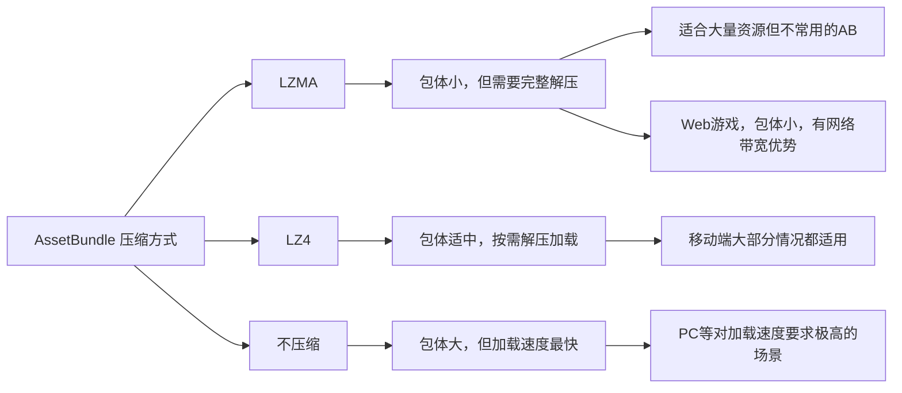

## 总结



## 一、三种压缩方式

| 压缩方式 | BuildAssetBundleOptions | 压缩率 | 加载方式     | 加载速度 |
|----------|-------------------------|--------|--------------|----------|
| LZMA     | None (默认)             | 70-80% | 必须整体解压 | 慢       |
| LZ4      | ChunkBasedCompression   | 50-60% | 边解压边加载 | 快       |
| 不压缩   | UncompressedAssetBundle | 0%     | 直接使用     | 最快     |

### LZMA（默认）

```csharp
// 构建选项：默认使用LZMA
BuildPipeline.BuildAssetBundles(
    outputPath,
    BuildAssetBundleOptions.None,  // LZMA压缩
    BuildTarget.StandaloneWindows64
);
```

**特点：**

- ✅ 压缩率最高（可达70-80%）
- ✅ 包体最小，适合网络传输
- ❌ 加载时必须整体解压到内存
- ❌ 有双倍内存峰值（压缩+解压）

**适用场景：**

- 包含大量资源但不常用的AB
- 网络带宽受限的情况
- 对内存不敏感的PC平台

``` title="内存示意"
原始AB文件: 10MB (LZMA压缩)
解压后大小: 30MB
加载时内存峰值: 10MB + 30MB = 40MB
```

### LZ4

```csharp
// 构建选项：使用LZ4
BuildPipeline.BuildAssetBundles(
    outputPath,
    BuildAssetBundleOptions.ChunkBasedCompression,  // LZ4压缩
    BuildTarget.StandaloneWindows64
);
```

**特点：**

- ✅ 压缩率中等（50-60%）
- ✅ 支持分块加载，按需解压
- ✅ 内存占用小
- ✅ 加载速度快

**适用场景：**

- **大部分情况的首选！**
- 移动平台（内存受限）
- 需要快速加载的资源
- 平衡包体和性能的场景

``` title="内存示意"
原始AB文件: 15MB (LZ4压缩)
解压后大小: 30MB
加载时内存峰值: 只加载需要的块，约5-10MB
```

### 不压缩

```csharp
// 构建选项：不压缩
BuildPipeline.BuildAssetBundles(
    outputPath,
    BuildAssetBundleOptions.UncompressedAssetBundle,  // 不压缩
    BuildTarget.StandaloneWindows64
);
```

**特点：**

- ✅ 加载速度最快
- ✅ 无需解压，直接使用
- ❌ 包体最大
- ❌ 下载时间长

**适用场景：**

- 对加载速度要求极高的资源
- 本地已有资源，不需要下载
- PC平台磁盘空间充足的情况

### 选择视情况而定

三种压缩方式没有绝对的优劣，针对不同情况选择不同的压缩策略才是最优解。比如在移动平台，LZ4 通常是大部分情况的选择；而 PC 平台单机游戏，某些包为了快速访问，而不担心磁盘占用，可能会选择不压缩；在 WebGL 平台，为了快速网络传输，需要包体尽量小，可能会选择 LZMA 压缩。

