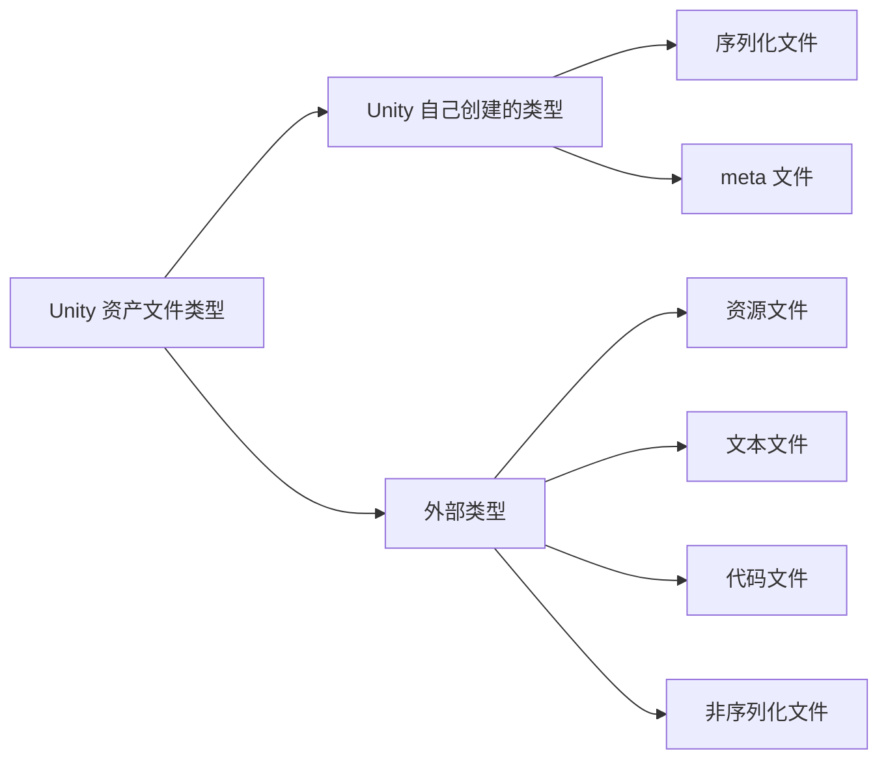

## 总结

### 1.序列化文件（也叫Native Asset）

序列化文件指 Unity 能够序列化的文件，一般是一些内置格式，比如 `*.prefab`、`*.unity3d`、`*.asset(ScriptableObject)`、`*.mat` 等等。

序列化文件能够在运行时直接反序列化为对应类（Unity内部定义或者开发人员自定义）的一个实例。

### 2.meta文件

meta 文件不会在 Unity 中显示，但它是 Unity 最重要的一类文件。
每个显示在 Project 视图的文件或者文件夹，Unity 会为其生成一个对应的 `*.meta` 文件，主要作用是：

- 为对应文件生成 GUID（唯一Id）
- 存储资源文件的 ImportSetting ：所有资源文件的导入设置数据（其实除了资源文件以外的文件，其 meta 中也有对应的 Importer，比如预制体的 PrefabImporter、`*.asset` 文件的 NativeFormatImporter，文件夹的 DefaultImporter 等等）
- 存储 AssetBundle 相关的数据：打 AB 包时的分类等数据

### 3.资源文件（也叫Imported Asset）

资源文件是指软件领域公认的一些后缀或者格式（比如 `*.png`、`*.fbx` 等），且 Unity 能够识别的文件。

这些文件由别的软件生产，不是 Unity 内置的格式，通过 Unity 提供的各种 Importer 转化为 Unity 编辑器认可的格式，转化的结果存放在 Library 文件夹下，不同版本的 Asset Pipeline 转换的机制和存放位置都不一样：

- Asset Pipeline Version 1：2019.3 版本之前使用这套 Asset Database。转换结果存放在 Library/metadata/ 下面，且可以通过 GUID 找到对应文件名的转换结果
- Asset Pipeline Version 1：2019.3 版本之后的版本使用。转换结果存放在 Library/Artifacts/ 下面，但无法根据 GUID 找到对应文件了

### 4.文本文件

文本文件比较特殊，它不是序列化文件，但是 Unity 可以识别为 TextAsset。很像资源文件，但是又不需要资源文件那样进行设置和转化。比如 `txt`、`xml` 文件等。

### 5.代码文件

包括 Unity 识别的代码文件、库文件、shader 等，在导入时，Unity 会自动进行一次编译。

### 6.非序列化文件

包括文件夹等 Unity 无法识别的文件