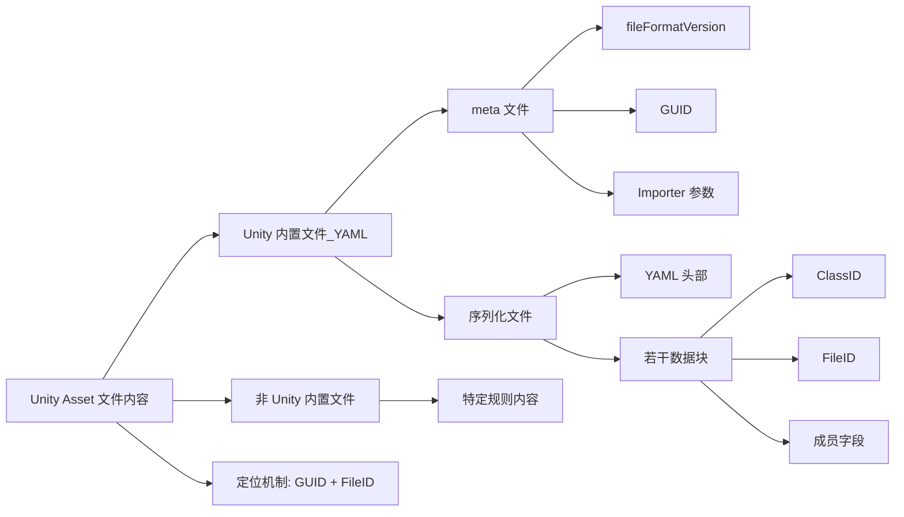

## 总结



## 一、不同Asset，内容格式不同

Unity 自己生产的 Asset 的格式内容，都使用 YAML 格式，按文件类型来说：

Unity 内置类型：

- 序列化文件：Unity内置文件类型，使用 YAML 格式
- meta文件：Unity内置文件类型，使用 YAML 格式

外部类型：

- 资源文件：外部软件生产，有自己的特定格式
- 文本文件：不同的文本格式
- 代码文件：不同的代码文本格式
- 非序列化文件：特定格式

从这个归纳来看，我们其实只需要看看 Unity 对内置文件（序列化文件和 meta 文件）怎么处理的即可。外部资源文件需要特定领域的知识，而文本和代码文件是明文的，非序列化文件有特定格式。

## 二、meta 文件

先了解 meta 文件，再看序列化文件。

Unity 编辑器会为每一个放在 Assets 目录下的可见文件创建一个同名的 meta 文件。

下面是一个音频文件的 meta 文件内容：

``` yaml  hl_lines="1-3"
fileFormatVersion: 2
guid: 8ac68b4fca715f34f86d8099420cf989
AudioImporter:
  externalObjects: {}
  serializedVersion: 7
  defaultSettings:
    serializedVersion: 2
    loadType: 2
    sampleRateSetting: 0
    sampleRateOverride: 44100
    compressionFormat: 1
    quality: 1
    conversionMode: 0
    preloadAudioData: 0
  platformSettingOverrides:
    4:
      serializedVersion: 2
      loadType: 2
      sampleRateSetting: 0
      sampleRateOverride: 44100
      compressionFormat: 1
      quality: 100
      conversionMode: 0
      preloadAudioData: 0
    7:
      serializedVersion: 2
      loadType: 2
      sampleRateSetting: 0
      sampleRateOverride: 44100
      compressionFormat: 1
      quality: 100
      conversionMode: 0
      preloadAudioData: 0
  forceToMono: 0
  normalize: 1
  loadInBackground: 0
  ambisonic: 0
  3D: 1
  userData:
  assetBundleName:
  assetBundleVariant:
```

高亮部分代表了 meta 的三个主要内容：

- fileFormatVersion：Unity Asset Pipeline 版本
- guid：Unity 为每一个 Asset 文件分配的唯一 Id
- Importer：不同类型 Asset 文件经 Unity 不同类型导入器导入后生成的设置数据

### 1. Unity Asset Pipeline Version

Unity Asset Pipeline 具体如何工作，这个话题单独开一篇。当前只需要理解：Unity 2019.3 之后使用的是第二版，基于 LMDB（Lightning Memory-Mapped Database, https://github.com/LMDB/lmdb）的 Asset Database

### 2. GUID

GUID 是 Unity 为每一个可见文件分配的唯一 Id，用于定位、引用任意文件。

### 3. Importer

不管是 Unity 内部的序列化文件，还是外部的资源文件、代码文件等，Unity 都无法直接使用它们。实际上，Unity 使用的是它们转换后的文件（存放在 Library/metadata 或者 Library/Artifacts 文件夹下）。

这里有个很容易搞错的点，Importer 并不是负责转换过程的。整个转换过程是底层完成且不可见的，Importer 的职责是在发生转换时，提供转换参数，并记录这些参数，这些参数通常是开发者决定的某些策略。

比如说，上面的 AudioImporter 记录了 `forceToMono: 0` 这一参数，它用于设置该音频是否强制使用单声道。本身这个音频文件是不带这个设置的，它可能本身就是一个单声道的音频，也可能是双声道的。但开发者需要根据游戏需要来决定策略，比如 UI 上的音频必须强制单声道，那么就会勾上它，Unity 转换出来的结果就是一个经过处理的单声道音频文件（Library下），然后在原始音频文件对应的 meta 文件中记录下这次用户设置的 `forceToMono: 1`。

它不会影响原始文件，仅影响转换后的结果。它提供持久化的设置，以便下次 Unity 知道该如何转换原始文件得到结果。

## 三、序列化文件

以最常见的 prefab 为例：

``` yaml
%YAML 1.1
%TAG !u! tag:unity3d.com,2011:
--- !u!1 &2548996960861856832
GameObject:
  ...
--- !u!224 &5130387460885348626
RectTransform:
  ...
--- !u!222 &7740301192594792805
CanvasRenderer:
  ...
--- !u!114 &7973370026506665244
MonoBehaviour:
  ...
--- !u!114 &5618074904614505148
MonoBehaviour:
  ...
```

它由下面的元素组成：

### 1.头部

``` yaml
%YAML 1.1
%TAG !u! tag:unity3d.com,2011:
```

### 2.若干数据块

``` yaml
--- !u!1 &2548996960861856832
GameObject:
  ...
```

`!u!1` 这里的 `1` 是 **ClassID** 的值，可以在 https://docs.unity3d.com/Manual/ClassIDReference.html 查询 ClassID 和类型的对应关系。比如这里 `1` 代表 GameObject，和下方的 GameObject 数据块是绑定的。再比如 `114` 代表它是一个 MonoBehaviour 类型的数据块。

后面紧跟的数组 `2548996960861856832` 是该数据块的 **FileID**。前面说过 **GUID** 可以引用一个 Asset 文件，但如果要引用一个 Asset 文件中的某个子数据（比如 prefab 的某个节点上挂的某个组件）就需要用到 GUID + FileID。所以有时候 FileID 又称 **LocalID**，就像是标记了 GUID 对应的文件中的一个 Local 的部分。

### 3.单个数据块的内容

其中某个自定义的组件对应的内容是下面这样的：

``` yaml  hl_lines="10"
--- !u!114 &5618074904614505148
MonoBehaviour:
  m_ObjectHideFlags: 0
  m_CorrespondingSourceObject: {fileID: 0}
  m_PrefabInstance: {fileID: 0}
  m_PrefabAsset: {fileID: 0}
  m_GameObject: {fileID: 2548996960861856832}
  m_Enabled: 1
  m_EditorHideFlags: 0
  m_Script: {fileID: 11500000, guid: b9baae69706a4c9d9868410df9b79855, type: 3}
  m_Name:
  m_EditorClassIdentifier:
```

高亮这一行表示，这个数据块引用了一个 MonoScript 类型的文件。MonoScript 类型的 ClassID 为 115，这种非内部格式的文件，Unity 会为它们按照内部计算规则定死一个 fileID 的值，凡是被 Unity 导入并识别的 *.cs 脚本资源，都被认为是一个 MonoScript 对象，所以这里 11500000 这个值代表它是一个 Unity 导入后的脚本资源。

!!! note "非内置格式对应的FileID"
    实际上，非内置格式文件对应的 FileID，通常都是它们的 ClassID × 100000 的值，比如：2100000 对应 Material（21），又或者 21300000 对应 Sprite（213），但这不总是成立，也有特殊的，比如图集的子图，它们的 fileID 都是随机生成的，所以这样的结论更合理：**对于导入型资源的主对象，FileID 往往等于 ClassID × 100000；对于导入产生的子对象，则没有这个保证。**

单个数据块在运行时，都可以被实例化为一个单独的 Unity Object（Unity 提供的所有的类都继承自它），所以一个 Unity Asset 被单次实例化后，甚至会产生多个对象。