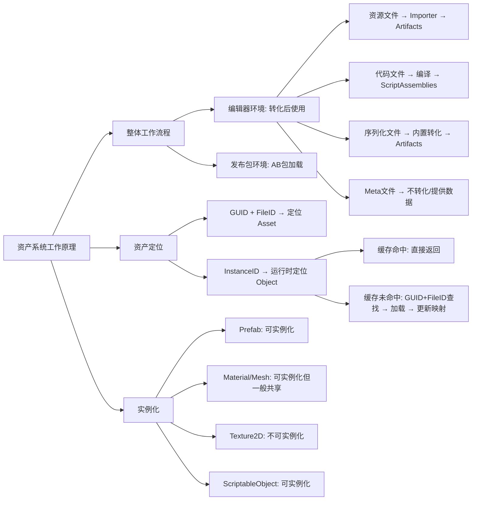

## 总结



## 一、整体工作流程


/// caption
资产系统整体工作流程
///

在编辑器环境下，Unity 实际上使用的是资产转化后的资产数据，不同的资产数据有不同的转化逻辑和结果：

- **资源文件：**非 Unity 内置格式，通过 Importer 转化，存放在 Library/Artifacts 下
- **代码文件：**通过编译转化，存放在 Library/ScriptAssemblies 下
- **非序列化文件：**不识别不转化
- **文本文件：**仅识别为 TextAsset ，不转化
- **序列化文件：**内置的转化，存放在 Library/Artifacts 下
- **Meta 文件：**不转化，但为转化提供数据

在发布包环境下，资产无需转化直接被加载使用，只不过需要以 AB 包的形式组织并从内存中加载，这部分内容较多，单独开篇。

## 二、Assets 的定位

前面的文章提过一嘴，通过 GUID 可以定位一个 Asset 文件；如果配合 FileID 则可以更进一步，定位到单个 Asset 文件中的某个子数据。这是定位 Asset File 。在运行时，需要定位的不是 Asset File 而是 Asset Object ，固若还是使用 GUID + FileID 的话，性能比较差。

Unity 采用的策略是使用 PersistentManager 将 GUID 和 FileID 转化为一个 InstanceID 。InstanceID 具有缓存机制以此加快访问速度，它由一个简单的递增函数计算得到，每次有新对象需要在缓存中注册的时候就加一。

```
引用查找
    ↓
查找 Instance ID 缓存
    ↓
缓存命中？
    ├─ 是 → 直接返回 Objects
    └─ 否 ↓
        通过 File GUID 找到 Asset
            ↓
        通过 File ID 定位 Object
            ↓
        加载到内存（分配新 Instance ID）
            ↓
        更新映射表
```

## 三、实例化

实例化的本质是为 Asset Object 创建一个副本，但不同的 Asset Objects 有不同的实例化表现，有的甚至不能实例化，是否可以实例化是实际生产中总结出来的：

- **Prefab：**可实例化，新的对象是一个完整的副本，并且可以在场景中显示。预制件设计本身就是希望作为一个原型使用，在运行时产生多份副本，它是可实例化的。
- **Material：**可实例化，但一般只有一份为共享材质球，如果需要新的副本，通过 new Material(sharedMat) 创建
- **Texture2D：**无法实例化，数据通常较大实例化成本高，加载出来后直接被引用使用，GPU 可以高效处理共享纹理
- **Mesh：**可实例化，但一般都是直接加载出来直接引用共享，除非需要创建独立副本改顶点之类的
- **ScriptableObject：**可以实例化，根据实际需求决定是否要执行实例化
- **其他资产：**通常无法实例化

从磁盘加载到内存中的那一份是原始副本（即 Asset Object），一般共享使用。除非有特殊需求，就实例化产生副本。某些类型代价过大直接不支持实例化。